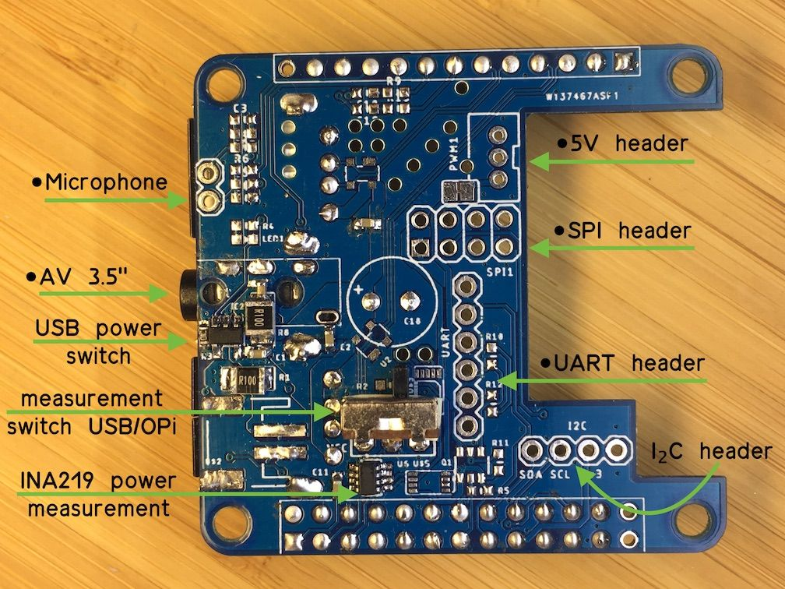

# Orange Pi Zero+ H5 Addons

## Hacking Addon



## TODO: DeviceTree

[Armbian docs for using overlays](https://docs.armbian.com/User-Guide_Allwinner_overlays/)

https://elinux.org/Device_Tree_Usage

[DTS for OrangePi Zero H2+](https://github.com/torvalds/linux/blob/master/arch/arm/boot/dts/sun8i-h2-plus-orangepi-zero.dts)

[DTS for OrangePi Zero H5](https://github.com/torvalds/linux/blob/master/arch/arm64/boot/dts/allwinner/sun50i-h5-orangepi-zero-plus.dts)

https://forum.armbian.com/topic/8795-next-lts-kernel-419y-allwinner-a10-a20-a64-h2-h3-h5-h6-debugging-party/?do=findComment&comment=67014

adding voltage regulator

```js
	reg_vdd_cpux: vdd-cpux-regulator {
		compatible = "regulator-gpio";
		regulator-name = "vdd-cpux";
		regulator-type = "voltage";
		regulator-boot-on;
		regulator-always-on;
		regulator-min-microvolt = <1100000>;
		regulator-max-microvolt = <1300000>;
		regulator-ramp-delay = <50>; /* 4ms */

		gpios = <&r_pio 0 6 GPIO_ACTIVE_HIGH>; /* PA6 */
		enable-active-high;
		gpios-states = <0>;
		states = <1100000 0
			  1300000 1>;
	};
```

```js
&cpu0 {
	cpu-supply = <&reg_vdd_cpux>;
};
```

adding usb power switch (https://www.kernel.org/doc/Documentation/devicetree/bindings/regulator/fixed-regulator.txt)

```js
	usb_pwr: usb_pwr {
		compatible = "regulator-fixed";
		regulator-name = "vbus-addon-supply";
		regulator-min-microvolt = <5000000>;
		regulator-max-microvolt = <5000000>;
		gpio = <&r_pio 0 7>;
		regulator-boot-on;
	};
```

[ina219 dt overlay](https://github.com/armbian/sunxi-DT-overlays/blob/master/examples/i2c-ina219.dts)

```js
/dts-v1/;
/plugin/;

/ {
	compatible = "allwinner,sun4i-a10", "allwinner,sun7i-a20", "allwinner,sun8i-h3", "allwinner,sun50i-a64", "allwinner,sun50i-h5";

	fragment@0 {
		target = <&i2c0>;
		__overlay__ {
			#address-cells = <1>;
			#size-cells = <0>;
			ina219@40 {
				compatible = "ti,ina219";
				reg = <0x40>;
				status = "okay";
				shunt-resistor = <100000>;
			};
		};
	};
};
```
